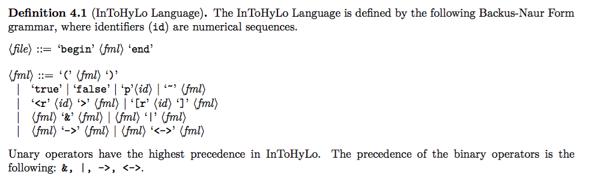
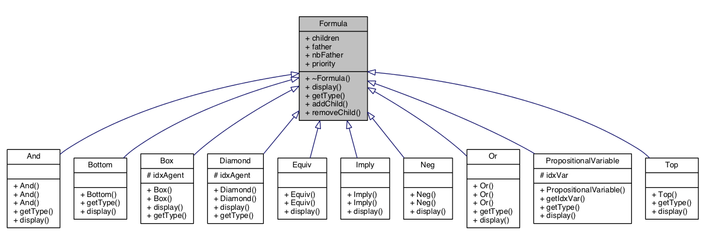

# README First

 - To compile: `make clean; make`

 - To generate the documentation: `doxygen`;

 - To execute `./bin/parser-intohylo path-to-formula-in-intohylo`

Here the Backus-Normal-Form of the InToHyLo format
	

The parser is using a classical algorithm of shift and reduce;

It is allowing the multiple modalities and each class represents a modal logic element (see documentation for more details).

## Class-Diagram
	

## Use Example

	begin 
		<r1>(p1 & p2)
	end

	begin
		~<r1>(~(p1 | [r2]p4))
	end

## Credits

- Jean-Marie Lagniez <lagniez@cril.fr>

- Daniel Le Berre <leberre@cril.fr>

- Tiago de Lima <delima@cril.fr>

- Valentin Montmirail <montmirail@cril.fr>